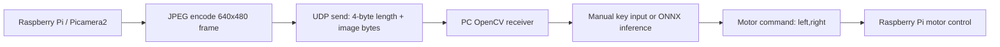

# Single-Camera RC Car Autonomous Driving

Raspberry Pi camera video is streamed to a PC over UDP, the PC performs
OpenCV/ONNX-based inference or manual driving logic, and motor commands are sent
back to the RC car.

This repository is a public portfolio reconstruction of the RC car prototype.
Raw driving videos, full image datasets, cache files, and large zip archives are
not included.

## Project Summary

| Item | Detail |
| --- | --- |
| Platform | Raspberry Pi, Picamera2, 2 DC motors |
| Main concept | Single camera based RC car control |
| Communication | UDP image transfer and motor command feedback |
| PC side | OpenCV display, manual WASD command, ONNX object inference |
| Raspberry Pi side | Camera capture, JPEG encoding, UDP send, motor control |
| My role | Camera/UDP communication, driving data collection, model experiment, control logic integration |

## Main Features

- Capture 640x480 frames from Picamera2 on Raspberry Pi.
- Compress each frame as JPEG and send it to the PC with a 4-byte size header.
- Receive motor commands in `left,right` format and drive two motors with `gpiozero`.
- Use keyboard input on the PC for data collection and manual control.
- Run ONNX inference on PC-side received frames and return simple follow/stop commands.
- Keep IR line-following experiments in `experiments/ir_line_following` as the earlier control baseline.

## Repository Structure

```text
.
├── src/
│   └── raspberry_cam/
│       ├── new_follower.py      # Raspberry Pi camera UDP client + motor control
│       ├── sever.image.py       # PC manual driving/data capture server
│       ├── sever_image2.py      # PC ONNX inference based following server
│       ├── server_follower.py   # Earlier object-following server prototype
│       ├── yolo_detector.py     # ONNX inference helper
│       └── last.onnx            # ONNX model used by the PC inference server
├── experiments/
│   └── ir_line_following/       # Earlier IR sensor / line-following experiments
├── requirements-pc.txt
├── requirements-raspberry-pi.txt
└── README.md
```

Original script names were kept intentionally so the code remains traceable to
the prototype files used during development.

## Control Flow



## How To Run

### 1. PC Receiver

Install PC dependencies:

```bash
pip install -r requirements-pc.txt
```

Manual driving/data capture server:

```bash
cd src/raspberry_cam
python sever.image.py
```

Controls:

| Key | Action |
| --- | --- |
| `w` | Forward |
| `s` | Backward |
| `a` | Left turn |
| `d` | Right turn |
| `1` | Save current frame |
| `Esc` | Exit |

ONNX inference based server:

```bash
cd src/raspberry_cam
python sever_image2.py
```

### 2. Raspberry Pi Client

Install Raspberry Pi dependencies:

```bash
pip install -r requirements-raspberry-pi.txt
```

Before running, edit `SERVER_IP` in `src/raspberry_cam/new_follower.py` to the
PC IP address.

```bash
cd src/raspberry_cam
python new_follower.py
```

The Raspberry Pi script sends camera frames to the PC and applies the returned
motor command to the two DC motors.

## Implementation Notes

- UDP was chosen to reduce latency for real-time RC car control.
- Each image packet starts with a 4-byte little-endian payload length so the PC
  can validate the received image bytes before decoding.
- JPEG quality is limited to keep each frame below the UDP packet size limit.
- Motor control is normalized from integer command values to `gpiozero.Motor`
  speed values.
- The PC server can be used both for manual driving/data collection and model
  inference testing.

## Development History

The `experiments/ir_line_following` directory contains earlier IR sensor and
line-following experiments:

- UDP command exchange between PC and Raspberry Pi.
- IR sensor data collection with keyboard labels.
- RandomForest and PyTorch-based control experiments.
- Lookup-table based autonomous line-following prototype.

These files are kept separately because the final portfolio focus is the
single-camera RC car pipeline.

## Limitations

- Raw dataset images and videos are excluded from GitHub.
- Some scripts contain fixed local IP addresses and must be edited for a new
  network.
- Hardware scripts require Raspberry Pi GPIO, Picamera2, and motor driver
  wiring; they are not expected to run on a normal Windows PC.
- The included ONNX model is a compact project artifact, not a general-purpose
  production model.

