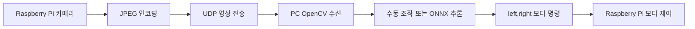

# 단일 카메라 기반 RC카 자율주행

라즈베리파이 카메라 영상을 PC로 UDP 전송하고, PC에서 OpenCV/ONNX 추론 또는 수동 조작 로직을 수행한 뒤 모터 명령을 다시 RC카로 보내는 단일 카메라 기반 RC카 제어 프로젝트입니다.

이 저장소는 포트폴리오 공개용으로 정리한 버전입니다. 원본 주행 영상, 전체 수집 이미지, 캐시 파일, 대용량 압축 파일, 최종 프로젝트와 직접 관련이 낮은 IR 센서 실험 코드는 제외했습니다.

## 프로젝트 개요

| 구분 | 내용 |
| --- | --- |
| 프로젝트 | 단일 카메라 기반 RC카 자율주행 |
| 목적 | 하나의 카메라 입력으로 주행 영상 수집, 객체 인식, 모터 제어까지 연결 |
| 플랫폼 | Raspberry Pi, Picamera2, DC Motor, PC |
| 통신 | UDP 기반 영상 전송 및 모터 명령 피드백 |
| 영상 처리 | OpenCV, JPEG 인코딩, ONNX Runtime 추론 |
| 담당 역할 | 라즈베리파이 카메라 송신, PC 수신 서버, UDP 통신, 모터 제어 연동, 수동 주행 데이터 수집, 객체 기반 제어 로직 구현 |

## 핵심 동작

1. Raspberry Pi에서 Picamera2로 640x480 영상을 캡처합니다.
2. 프레임을 JPEG로 압축하고, 4바이트 길이 헤더와 함께 PC로 UDP 전송합니다.
3. PC 서버는 수신한 이미지를 OpenCV로 디코딩합니다.
4. 수동 제어 모드에서는 `WASD` 키 입력을 모터 명령으로 변환합니다.
5. 추론 모드에서는 ONNX 모델 결과를 기준으로 객체 위치를 판단합니다.
6. PC가 `left,right` 형식의 모터 명령을 Raspberry Pi로 다시 전송합니다.
7. Raspberry Pi가 수신한 명령으로 좌우 DC 모터를 제어합니다.

## 폴더 구조

```text
.
├── models/
│   └── last.onnx                      # PC 추론 서버에서 사용하는 ONNX 모델
├── src/
│   ├── pc/
│   │   ├── manual_control_server.py   # PC 수동 조작/영상 저장 서버
│   │   ├── object_following_server.py # PC ONNX 추론 기반 제어 서버
│   │   └── yolo_detector.py           # ONNX 추론 및 박스 시각화 함수
│   └── raspberry_pi/
│       └── camera_motor_client.py     # Raspberry Pi 카메라 송신 및 모터 제어
├── requirements-pc.txt
├── requirements-raspberry-pi.txt
└── README.md
```

## 실행 방법

### 1. PC 환경

```bash
pip install -r requirements-pc.txt
```

수동 주행 및 영상 저장 서버:

```bash
python src/pc/manual_control_server.py
```

수동 제어 키:

| 키 | 동작 |
| --- | --- |
| `w` | 전진 |
| `s` | 후진 |
| `a` | 좌회전 |
| `d` | 우회전 |
| `1` | 현재 프레임 저장 |
| `Esc` | 종료 |

ONNX 추론 기반 제어 서버:

```bash
python src/pc/object_following_server.py
```

### 2. Raspberry Pi 환경

```bash
pip install -r requirements-raspberry-pi.txt
```

`src/raspberry_pi/camera_motor_client.py`의 `SERVER_IP` 값을 PC IP 주소로 수정한 뒤 실행합니다.

```bash
python src/raspberry_pi/camera_motor_client.py
```

라즈베리파이에서는 Picamera2와 GPIO 모터 제어가 필요하므로 일반 Windows PC에서는 실행 대상이 아닙니다.

## 제어 흐름



## 구현 포인트

- UDP를 사용해 프레임 전송 지연을 줄였습니다.
- UDP 패킷 앞에 4바이트 길이 정보를 붙여 이미지 데이터 길이를 검증했습니다.
- JPEG 품질을 낮춰 UDP 단일 패킷 크기 제한을 넘지 않도록 처리했습니다.
- PC 서버와 Raspberry Pi 클라이언트를 분리해 모델 추론은 PC에서, 모터 제어는 Raspberry Pi에서 수행하도록 구성했습니다.
- 수동 조작 서버를 통해 실제 주행 데이터를 저장하고, 추론 서버를 통해 객체 위치 기반 제어를 실험했습니다.

## 파일 정리 기준

공개 저장소에는 단일 카메라 RC카 동작을 설명하는 데 필요한 파일만 남겼습니다.

- 포함: 카메라 송신, PC 수신, 모터 명령, ONNX 추론, README, 의존성 파일
- 제외: `__pycache__`, `.vscode`, 수집 이미지, 주행 영상, zip 파일, IR 센서 기반 라인 트레이싱 실험 코드, 누락 모델을 참조하는 테스트 코드

## 트러블슈팅

| 문제 | 원인 | 해결 |
|---|---|---|
| PC에서 영상 프레임이 깨지거나 멈춤 | UDP 특성상 패킷 손실이 발생하거나 JPEG 데이터 길이를 정확히 알 수 없음 | 4바이트 길이 헤더를 붙여 수신 길이를 검증하고 JPEG 품질을 낮춰 패킷 크기를 줄임 |
| Raspberry Pi와 PC가 서로 통신하지 못함 | PC IP, 포트, 같은 네트워크 여부가 맞지 않음 | `SERVER_IP`를 PC의 실제 IP로 수정하고 송수신 포트를 분리해 확인 |
| Windows PC에서 Raspberry Pi 클라이언트가 실행되지 않음 | `Picamera2`, GPIO 제어는 Raspberry Pi 환경 전용 | PC에서는 `src/pc` 서버만 실행하고, 클라이언트는 Raspberry Pi에서 실행하도록 분리 |
| 객체 추론은 되지만 제어가 늦게 반응함 | 영상 전송, 디코딩, ONNX 추론, 명령 피드백이 한 루프에 묶여 지연 발생 | 추론은 PC에서 수행하고 Raspberry Pi는 카메라 송신과 모터 제어만 담당하도록 역할을 분리 |
| 모터 방향이 의도와 반대로 움직임 | DC 모터 배선 또는 좌우 채널 매핑이 실험 환경과 다름 | `left,right` 명령 값을 기준으로 좌우 모터 핀 매핑을 실행 환경에 맞게 조정 |

## 한계 및 개선 방향

- 현재 IP 주소와 GPIO 핀 번호는 실험 환경 기준이므로 실행 환경에 맞게 수정해야 합니다.
- 단일 카메라만 사용하기 때문에 가까운 장애물의 거리 판단은 제한적입니다.
- 초음파 센서나 ToF 센서를 추가하면 거리 기반 회피 로직을 더 안정화할 수 있습니다.
- 추론 서버의 제어 로직은 객체 중심 위치 기반의 단순 제어이므로, 차선 보정과 장애물 회피 우선순위를 더 체계적으로 분리할 수 있습니다.
