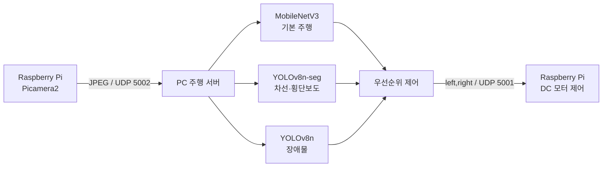

# 단일 카메라 기반 RC카 자율주행

Raspberry Pi 카메라 한 대의 영상을 PC로 전송하고, **모방학습·차선 세그멘테이션·횡단보도 정지·장애물 회피**를 결합해 RC카를 제어한 프로젝트입니다.

## 프로젝트 요약

| 구분 | 내용 |
| --- | --- |
| 플랫폼 | Raspberry Pi, YAHBOOM RC카, Picamera2 |
| 통신 | UDP 5002 영상 전송 / UDP 5001 모터 명령 |
| 기본 주행 | MobileNetV3-Small 기반 모방학습 |
| 환경 인식 | YOLOv8n-seg 차선·횡단보도, YOLOv8n 장애물 감지 |
| 영상 처리 | OpenCV, JPEG 인코딩 |
| 구현 범위 | 주행 데이터 수집, 모델 학습, 비동기 인식, 우선순위 제어, 결과 화면 |

## 문제와 해결 전략

차선 마스크의 위치만으로 조향값을 계산하면 S자 커브에서 제어가 불안정했습니다. 실제 운전 데이터를 학습한 모방학습을 기본 주행으로 사용하고, YOLO 인식 결과는 위험 상황에만 개입하는 안전장치로 구성했습니다.

```text
횡단보도 정지 > 장애물 회피 > 차선 이탈 보정 > 모방학습 기본 주행
```



## 단계별 구현

### 1. 주행 데이터 수집과 모방학습

- `WASD`와 복합키 입력을 모터값으로 변환했습니다.
- OpenCV의 단일 키 입력 한계를 키별 만료 시각 추적으로 보완했습니다.
- 정지 프레임은 저장하지 않아 클래스 불균형을 줄였습니다.
- MobileNetV3-Small을 밝기·대비 증강과 클래스 가중치로 파인튜닝했습니다.

### 2. 차선 안전장치

- YOLOv8n-seg로 `inline`, `outline`, `crosswalk`를 분할했습니다.
- 하단 차선 마스크 중심이 화면 중앙에서 130px 이상 벗어난 상태가 연속될 때만 보정했습니다.
- 차선 추론을 별도 스레드로 분리해 주행 루프 지연을 줄였습니다.
- 원본 실험 기준 차선 Mask mAP50은 `0.932`였습니다.

### 3. 횡단보도와 장애물 대응

- 횡단보도 신뢰도가 임계값을 넘으면 3초 정지하고 쿨다운으로 중복 정지를 막았습니다.
- 장애물은 최소 박스 면적과 연속 검출 조건으로 노이즈를 걸렀습니다.
- 장애물 위치에 따라 회피 조향, 직진, 복귀 조향, 차선 복귀, 쿨다운의 순서로 제어했습니다.

## 실행 영상

- [통합 자율주행 영상](media/autonomous-driving.mp4)
- [횡단보도 정지·회피 영상](media/crosswalk-avoidance.mp4)

## 저장소 구조

```text
.
├── media/
│   ├── autonomous-driving.mp4
│   └── crosswalk-avoidance.mp4
├── models/
│   └── README.md
├── src/
│   ├── pc/
│   │   ├── manual_control_server.py
│   │   ├── imitation_drive_server.py
│   │   ├── lane_guard_server.py
│   │   ├── crosswalk_drive_server.py
│   │   └── integrated_autonomous_server.py
│   └── raspberry_pi/
│       └── camera_motor_client.py
├── training/
│   ├── train_imitation.py
│   ├── train_lane_segmentation.py
│   └── train_obstacle_detection.py
├── requirements-pc.txt
└── requirements-raspberry-pi.txt
```

## 실행 준비

### PC

```bash
pip install -r requirements-pc.txt
```

학습된 가중치를 [models/README.md](models/README.md)의 이름에 맞춰 배치한 뒤 최종 서버를 실행합니다.

```bash
python src/pc/integrated_autonomous_server.py
```

| 키 | 기능 |
| --- | --- |
| `Space` | 자율주행 일시정지·재개 |
| `L` | 차선 안전장치 켜기·끄기 |
| `Esc` | 종료 |

### Raspberry Pi

```bash
pip install -r requirements-raspberry-pi.txt
```

PC의 IP를 환경 변수로 지정한 뒤 클라이언트를 실행합니다.

```bash
export RC_CAR_SERVER_IP=192.168.0.6
python src/raspberry_pi/camera_motor_client.py
```

Windows PowerShell에서는 `$env:RC_CAR_SERVER_IP="192.168.0.6"` 형식을 사용합니다.

## 학습

데이터셋은 공개 저장소에 포함하지 않습니다. 아래 구조로 배치한 뒤 학습 스크립트를 실행합니다.

```text
data/
├── drive_dataset/
├── lane_dataset/
└── object_dataset/
```

```bash
python training/train_imitation.py
python training/train_lane_segmentation.py
python training/train_obstacle_detection.py
```

## 트러블슈팅

| 문제 | 원인 | 해결 |
| --- | --- | --- |
| `W+A`, `W+D` 동시 입력이 인식되지 않음 | `cv2.waitKey()`는 한 번에 한 키만 반환 | 키별 만료 시각을 두고 짧은 시간 안의 입력을 조합 |
| 정지 데이터가 지나치게 많음 | 모든 프레임을 저장하면 `stop`이 대부분을 차지 | 실제 주행 명령이 있는 프레임만 저장 |
| 차선 추론 중 주행이 끊김 | YOLO 추론이 메인 제어 루프를 차단 | 차선·객체 추론을 별도 스레드로 분리 |
| 장애물 오감지 | 단일 프레임 노이즈와 작은 원거리 박스 | 연속 검출과 최소 박스 면적 조건 적용 |
| 회피 후 차선을 벗어남 | 한 번의 조향만으로 복귀 위치를 제어하기 어려움 | 회피·직진·복귀·직진·쿨다운의 단계 제어 적용 |
| 영상이 깨지거나 수신되지 않음 | UDP 패킷 손실 또는 JPEG 크기 초과 | 4바이트 길이 헤더 검증과 JPEG 품질 조정 |
| 모터 방향이 반대로 동작 | 실제 배선과 코드의 좌우·정역 매핑 차이 | GPIO 핀과 모터 부호를 차량 배선에 맞게 조정 |

## 한계와 향후 개선

- 단안 카메라만으로는 실제 거리를 직접 측정하기 어려워 가까워진 뒤 장애물을 감지할 수 있습니다.
- 초음파 또는 ToF 센서를 결합하면 거리 기반 조기 회피가 가능합니다.
- 현재 회피는 시간 기반이므로 주행 속도와 배터리 상태에 영향을 받습니다. 거리·자세 피드백 기반 제어로 개선할 수 있습니다.
- UDP는 지연이 낮지만 패킷 손실 가능성이 있습니다. 프레임 번호와 누락 감지 로직을 추가할 수 있습니다.
